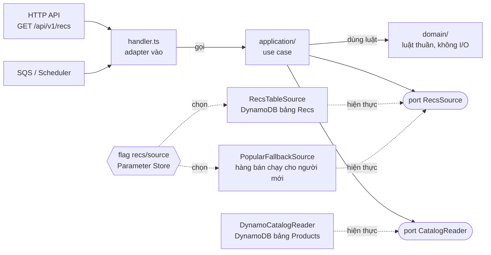
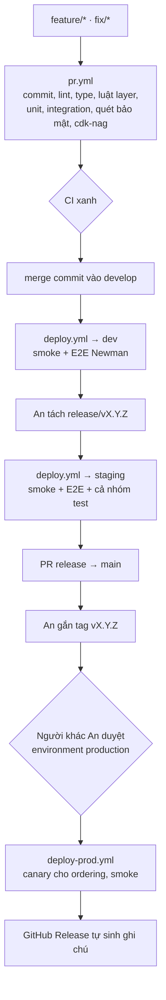

# Kế hoạch kỹ thuật

Bản 1.1 · 30/09/2026 · nhóm An · Hoàng · Nhân

Tài liệu này biến hướng đi đã chốt thành cách làm việc hằng ngày: ai làm gì, code đi từ một nhánh lên production ra sao, được kiểm thử, triển khai, quay lui và vận hành thế nào. Phần nghiệp vụ chi tiết nhóm sẽ gửi sau. Những chỗ phụ thuộc vào nó được đánh dấu **(chờ nghiệp vụ)**.

Tài liệu đi kèm:

- [git-flow.md](git-flow.md): quy trình Git của nhóm
- [hands-on-testing-guide.md](hands-on-testing-guide.md): cách viết và chạy test
- [adr/](adr/): các quyết định kiến trúc
- [business/](business/): nghiệp vụ, mẫu gửi và câu hỏi cần chốt
- [review-2026-09-30.md](review-2026-09-30.md): góp ý kế hoạch ban đầu, link lab theo vai

## 1. Tám giai đoạn

| # | Giai đoạn | Thời gian | Đầu ra chính |
|---|---|---|---|
| 0 | Khởi tạo | Tuần 1 | Vai trò, repo, tài khoản, CI cho PR, quy ước |
| 1 | Yêu cầu | Tuần 1–2 | Nghiệp vụ → user story → tiêu chí nghiệm thu → OpenAPI |
| 2 | Thiết kế | Tuần 1–2 | Layer, API, dữ liệu, bảo mật, ADR |
| 3 | Xây dựng | Tuần 2–6 | Sprint 2 tuần, git flow, review, chuẩn code |
| 4 | Kiểm thử | Mọi tuần | Unit, integration, E2E và các cổng chất lượng |
| 5 | Triển khai | Từ tuần 2 | dev và staging tự động, prod có duyệt, canary, rollback |
| 6 | Vận hành | Từ tuần 4 | Log, trace, alarm, runbook, chi phí |
| 7 | Đóng dự án | Tuần 7–8 | Báo cáo FCAJ, demo, dọn dẹp, retro |

### Việc cần xong trong tuần này

1. **An** mời Hoàng và Nhân vào repo, rồi làm tiếp các bước trong [setup-checklist.md](setup-checklist.md).
2. **An** dựng module mẫu `catalog` đúng layer ở mục 5, để Hoàng và Nhân làm theo khuôn.
3. **Cả nhóm** gửi nghiệp vụ trước hết Chủ nhật 05/10, theo mẫu trong [business/](business/). Sau ngày này, phần chưa có nghiệp vụ sẽ bị đẩy lùi.

## 2. Nguyên tắc

- **Mọi thứ là code:** hạ tầng (CDK), pipeline, cấu hình. Không ai sửa tay dev, staging hay prod trên console.
- **`main` luôn deploy được.** Thứ gì lên prod cũng đã được test trên staging.
- **Build một lần, deploy nhiều nơi:** cùng commit thì cùng gói code.
- **Bảo mật và chi phí là cổng chặn trong pipeline**, không phải việc để cuối.
- **PR nhỏ, CI xanh mới merge.** PR vào `develop` không cần duyệt để cả nhóm test chung nhanh; `release/*` và `main` cần 1 người khác duyệt.
- **Đo bằng số:** các mục tiêu dưới đây và 4 chỉ số DORA ở mục 10.

## 3. Mục tiêu phi chức năng (bản đầu)

| Thuộc tính | Mục tiêu | Đo bằng |
|---|---|---|
| API đọc | p95 ≤ 300 ms ở 200 người ảo; ≤ 80 ms khi trúng cache CloudFront | k6, CloudWatch |
| API ghi (đặt hàng) | p95 ≤ 800 ms; việc chậm như gửi email đẩy sang SQS | k6, X-Ray |
| Khởi động lạnh | Init ≤ 800 ms với Node.js 24, arm64, gói code dưới 1 MB | CloudWatch Init Duration |
| Web | Lighthouse Performance ≥ 90; LCP ≤ 2,5 s trên 4G; JS ban đầu ≤ 250 KB gzip | Lighthouse |
| Sẵn sàng | 99,5% trong giai đoạn demo; lỗi 5xx dưới 1% | CloudWatch |
| Bảo mật | Không lỗ hổng High/Critical đang mở; luồng chính đạt OWASP ASVS mức 1 | Các lượt quét, checklist |
| Chất lượng mã | Coverage ≥ 80% cho domain và application; 0 lỗi lint | Vitest, pytest |
| Chi phí | Dưới $15 cả dự án; có chỉ số chi phí trên 1.000 đơn | Cost Explorer theo tag |
| Phục hồi | RPO ≤ 5 phút, RTO ≤ 1 giờ cho dữ liệu đơn hàng | Diễn tập tuần 6 |
| Vận hành | Mọi alarm có runbook; khắc phục sự cố dưới 1 giờ | Runbook, DORA |

Các con số này sẽ chỉnh khi có nghiệp vụ, nhất là số người dùng và số đơn giả định cho demo **(chờ nghiệp vụ)**.

## 4. Quy trình làm việc

### Nhịp

- **Sprint 0** tuần 1 · **Sprint 1** tuần 2–3 · **Sprint 2** tuần 4–5 · **Hardening** tuần 6 · **Release** tuần 7–8
- **Lập kế hoạch** đầu sprint, 45 phút: chọn việc từ backlog, ai nhận việc nào
- **Standup viết** lúc 9:00 trong nhóm chat: hôm qua, hôm nay, vướng gì. Dùng lại được cho worklog FCAJ
- **Demo cuối sprint** trên staging, mời mentor nếu được. **Retro** 20 phút ngay sau đó

### Bảng công việc (GitHub Projects)

**Backlog** → **Ready** (đạt DoR) → **In progress** (tối đa 2 việc mỗi người) → **In review** → **Done** (đã lên dev, đã nghiệm thu) → **Released**.

Mỗi việc là một GitHub issue. Nhánh mang số issue (`feature/12-cart-api`), PR có dòng `Closes #12`, để lần ngược được từ việc tới code. DoR và DoD nằm trong [CONTRIBUTING.md](../CONTRIBUTING.md).

### Ma trận trách nhiệm (RACI)

R làm · A chịu trách nhiệm cuối (mỗi dòng một người) · C được hỏi ý kiến · I được báo.

| Việc | An | Hoàng | Nhân |
|---|---|---|---|
| Kiến trúc, layer, ADR | A R | C | C |
| CDK, môi trường, pipeline CI/CD | A R | I | C |
| Catalog, giỏ hàng, đơn hàng, admin | C | A R | C |
| Dữ liệu, mô hình gợi ý tự xây, pipeline mỗi đêm | C | I | A R |
| API và widget gợi ý trên web | A R | C | C |
| Threat model, test bảo mật, bảo vệ dữ liệu | R | C | A R |
| Chiến lược test, cổng chất lượng | A R | R | R |
| Tách release, gắn tag, deploy prod | A R | C | C |
| Chi phí và budget | A R | I | C |
| Báo cáo FCAJ, workshop nhóm (mỗi người một phần) | A R | R | R |

### Việc khởi tạo trong Sprint 0

- **An:** mời thành viên, hoàn tất [setup-checklist.md](setup-checklist.md); CDK bootstrap ở tài khoản của mình (vừa là tài khoản demo vừa là sandbox, region ap-southeast-1) và hướng dẫn Hoàng, Nhân bootstrap tài khoản của họ; role OIDC cho GitHub Actions; Budgets $5/$10/$20 ở cả 3 tài khoản; module mẫu `catalog`.
- **Hoàng:** cài môi trường (Node 24, pnpm, Docker Desktop, AWS CLI, Postman); viết OpenAPI bản 0 cho catalog và cart; khung React chạy trên mock Prism.
- **Nhân:** threat model bản 0 và phân loại dữ liệu; script sinh dữ liệu v1; chốt cách tính gợi ý (ADR-0016).
- **Cả nhóm:** đọc git-flow.md và hands-on-testing-guide.md; buổi 60 phút đi qua module mẫu; gửi nghiệp vụ trước 05/10.

## 5. Kiến trúc và layer

### Quyết định: modular monolith, bên trong mỗi module là Hexagonal rút gọn (ADR-0009)

Cả hệ thống là một **modular monolith**: một repo, một pipeline, deploy cùng lúc và chung số phiên bản, nhưng chia thành các module theo nghiệp vụ: `catalog`, `cart`, `ordering`, `recommendation`, `events`, `admin`. Mỗi module có Lambda, bảng DynamoDB và quyền IAM riêng, và không import code của module khác. Vì sao không chọn microservices, và Hexagonal khác 3 layer ở đâu: xem [ADR-0009](adr/0009-layer-hexagonal-rut-gon.md).

Bên trong mỗi module:

- **handler** nhận request, kiểm input, gọi use case
- **application** chứa use case, chỉ gọi **port** (interface)
- **domain** chứa luật nghiệp vụ thuần, không I/O, không AWS SDK
- **infra** chứa **adapter** cho DynamoDB, SQS, hiện thực các port

Mỗi module deploy thành **một Lambda** có router nhỏ bên trong; mỗi worker chạy nền là một Lambda riêng.



Lõi module không biết dữ liệu nằm ở bảng nào, nó chỉ gọi port. Mô hình có vấn đề thì chuyển sang hàng bán chạy chỉ bằng cách đổi flag để chọn adapter khác, không sửa use case và không sửa test của lõi.

Sơ đồ trên là cấu trúc code. **Sơ đồ kiến trúc AWS trong báo cáo FCAJ nhóm phải tự vẽ** bằng draw.io với icon AWS; sơ đồ do AI vẽ bị 0 điểm.

### So sánh các lựa chọn

| Kiểu layer | Độ phức tạp | Hiệu năng trên Lambda | Dễ kiểm soát | Dễ test | Hợp với nhóm |
|---|---|---|---|---|---|
| 3 tầng Controller → Service → Repository | Thấp | Tốt | Vừa: service dễ phình, repository dễ lẫn logic | Vừa: dễ dính DB | Rất quen, giống Spring |
| Clean Architecture đủ các vòng | Cao | Tốt nhưng nhiều file | Cao | Cao | Nặng cho 8 tuần |
| **Hexagonal rút gọn (chọn)** | Vừa | Tốt | Cao: luật phụ thuộc kiểm bằng máy | Cao: lõi test không cần AWS | Hợp: 3 tầng quen + interface |
| Vertical slice | Thấp | Tốt | Vừa: dễ lặp code | Vừa | Được |
| NestJS hoặc Express trong Lambda | Vừa | Kém hơn: gói to, khởi động chậm | Cao | Cao | Được, nhưng che mất mô hình Lambda |

| Chia Lambda theo | Số hàm | Khởi động lạnh | Quyền IAM | Khi deploy lỗi |
|---|---|---|---|---|
| Mỗi route một Lambda | ~25 | Nhiều hàm lạnh riêng lẻ | Hẹp nhất | Ảnh hưởng 1 route |
| **Mỗi module một Lambda (chọn)** | 6–8 | Ít hơn vì traffic dồn vào ít hàm | Theo module, đủ hẹp | Ảnh hưởng 1 module |
| Cả app một Lambda | 1 | Ít lần nhưng gói to nên mỗi lần chậm | Rộng: một role đọc ghi mọi bảng | Sập cả app |

### Cấu trúc một module

```text
services/api/src/modules/ordering/
├─ handler.ts            adapter vào: parse, validate (zod), lấy claims JWT, gọi use case, map lỗi
├─ routes.ts             bảng route → use case: { "POST /api/v1/orders": placeOrder, ... }
├─ application/
│  ├─ placeOrder.ts      use case: điều phối, gọi port, không chứa chi tiết AWS
│  └─ getOrder.ts
├─ domain/
│  ├─ order.ts           entity, trạng thái, luật chuyển trạng thái
│  └─ pricing.ts         luật tính tiền: hàm thuần
├─ ports.ts              interface: OrderRepository, OrderEvents, StockReader
└─ infra/
   ├─ dynamoOrderRepository.ts
   └─ sqsOrderEvents.ts
services/api/src/shared/  logger, tracer, lỗi chuẩn, http helpers, config, idempotency
```

### Luật phụ thuộc (CI chặn nếu vi phạm, cấu hình ở `.dependency-cruiser.cjs`)

- `domain` không import gì ngoài chính nó
- `application` chỉ import `domain` và `ports`
- `infra` hiện thực `ports`, được import AWS SDK
- `handler` ghép mọi thứ lại; là nơi duy nhất biết về event của Lambda
- Module không import module khác; cần dữ liệu của nhau thì qua port hoặc sự kiện

### Quy ước API

- Đường dẫn `/api/v1/...`, danh từ số nhiều. CloudFront chuyển `/api/*` sang API Gateway, nên web và API cùng tên miền
- Phân trang bằng cursor, `limit` tối đa 50
- Lỗi theo RFC 9457 (`application/problem+json`) kèm `traceId`, không lộ stack trace
- `POST /api/v1/orders` bắt buộc header `Idempotency-Key`
- Thời gian ISO 8601 UTC; tiền là số nguyên VND; ID dạng ULID
- `contracts/openapi.yaml` là nguồn sự thật; web và API sinh type từ file này (ADR-011)

### Đòn bẩy hiệu năng

| Đòn bẩy | Vì sao | Áp dụng ở |
|---|---|---|
| arm64 (Graviton), Node.js 24 | Rẻ hơn x86 và thường nhanh hơn; Node 24 là bản Lambda mới nhất đang hỗ trợ chính thức | Mọi Lambda Node |
| esbuild bundle, minify, tree-shake | Gói nhỏ thì khởi động nhanh. AWS khuyên đóng gói luôn các module SDK v3 mình dùng | CDK NodejsFunction |
| Khởi tạo ngoài handler | Client SDK và cấu hình tạo một lần, dùng lại cho các lần gọi sau | Mọi handler |
| Cache cấu hình 5 phút | Không đọc Parameter Store ở mỗi request | Powertools Parameters |
| Khoá DynamoDB theo truy vấn | Chỉ GetItem và Query, không Scan trong API; chỉ lấy thuộc tính cần | Mọi repository |
| Cache ở CloudFront | Danh sách sản phẩm công khai cache 60 giây | `GET /api/v1/products` |
| Đẩy việc chậm sang SQS | API trả lời ngay; email và việc phụ chạy nền | Đặt hàng |
| Chỉnh bộ nhớ Lambda bằng đo đạc | Bắt đầu 1024 MB cho API rồi đo lại | Tuần 6 |
| Web chia code theo trang | Chỉ tải JS của trang đang xem; dữ liệu cache bằng TanStack Query | `apps/web` |

### Dữ liệu: mỗi module một bảng (ADR-012) (chờ nghiệp vụ)

| Bảng | Module | Khoá | Truy vấn chính |
|---|---|---|---|
| `products` | catalog | PK `productId`; GSI theo `category` | Chi tiết; liệt kê theo loại, phân trang |
| `carts` | cart | PK `userId` | Đọc và ghi giỏ của chính mình |
| `orders` | ordering | PK `userId`, SK `orderId` (ULID); GSI theo `status` + thời gian | Lịch sử đơn; admin lọc theo trạng thái |
| `cart-idempotency` | cart | PK `id`, TTL 24 giờ (Powertools) | Chống gộp giỏ hai lần (ADR-0017) |
| `order-idempotency` | ordering | PK `id`, TTL 24 giờ (Powertools) | Chống tạo đơn trùng (ADR-0017) |
| `events` | events | PK mã người dùng đã ẩn danh, SK thời gian; TTL 90 ngày | Job đêm gom sự kiện đi train |
| `recs` | recommendation | PK `USER#…` hoặc `ITEM#…`, SK phiên bản | Đọc gợi ý của phiên bản đang bật |

Mọi bảng dùng on-demand. Ở prod, `orders` và `products` bật point-in-time recovery và chống xoá nhầm.

## 6. Git flow

Chi tiết: [git-flow.md](git-flow.md). Tóm tắt (ADR-010):

- `feature/*` tách từ `develop`, merge lại bằng **merge commit** qua PR
- `develop` tự deploy lên **dev**
- Cuối sprint An tách `release/vX.Y.Z`; nhánh này tự deploy lên **staging** để cả nhóm test; lỗi sửa bằng `fix/*` tách từ nhánh release
- Test xong, `release/*` merge vào `main`; An gắn tag `vX.Y.Z` bằng `git tag -a`; tag được deploy lên **prod** sau khi có người khác duyệt; release merge ngược về `develop`
- `hotfix/*` tách từ `main`, merge vào `main` và `develop`
- Commit theo `<type>(<scope>): <mô tả>`, có thêm các loại `merge`, `release`, `review`, `fixreview`

## 7. Xây dựng

### Repo

```text
shop-ai/
├─ apps/web/                  React + Vite + TypeScript, TanStack Query, React Router
├─ services/api/src/modules/  catalog · cart · ordering · recommendation · events · admin
├─ services/api/src/shared/   logger, tracer, lỗi chuẩn, http, config, idempotency
├─ services/workers/          order-processor (SQS) · cost-breaker (Scheduler)
├─ data/                      Python: sinh dữ liệu · mô hình gợi ý · pipeline mỗi đêm · kiểm tra dữ liệu
├─ infra/                     CDK TypeScript: các stack + cấu hình theo môi trường
├─ contracts/openapi.yaml     nguồn sự thật của API
├─ tests/e2e-api/             Postman collection chạy bằng Newman
├─ tests/e2e-ui/              Playwright (tuỳ chọn)
├─ tests/load/                k6
├─ docs/                      kế hoạch, git flow, testing, ADR, nghiệp vụ, runbook, workshop
└─ .github/                   workflow, CODEOWNERS, mẫu PR và issue, dependabot
```

### Công cụ

| Việc | Công cụ |
|---|---|
| Ngôn ngữ, runtime | TypeScript strict, Node.js 24 (Lambda `nodejs24.x`); Python 3.13 cho phần dữ liệu |
| Quản lý gói | pnpm workspaces, lockfile bắt buộc; uv cho Python |
| Chất lượng mã | ESLint, Prettier, dependency-cruiser; ruff, mypy |
| Commit | commitlint + husky: kiểm tra mỗi commit trên máy và trong CI |
| API contract | OpenAPI 3.1; openapi-typescript; Prism dựng mock cho web; zod kiểm input |
| Lambda | Powertools for AWS Lambda: Logger, Tracer, Metrics, Idempotency, Parameters, Batch |
| Hạ tầng | AWS CDK v2, cdk-nag |
| Kiểm thử | Vitest, Testcontainers, pytest, Postman/Newman, Playwright, k6 |
| Chạy tại máy | Docker Desktop (WSL2); `cdk watch --hotswap` vào tài khoản của chính mình |

Chuẩn code và vòng làm việc hằng ngày: [CONTRIBUTING.md](../CONTRIBUTING.md).

## 8. Kiểm thử và cổng chất lượng

Cách viết test chi tiết: [hands-on-testing-guide.md](hands-on-testing-guide.md).

| Cấp | Kiểm tra gì | Công cụ | Ai | Chạy khi | Cổng |
|---|---|---|---|---|---|
| Tĩnh | Kiểu, lint, luật layer, luật IaC, commit message, secret | tsc, ESLint, dependency-cruiser, cdk-nag, commitlint, gitleaks | Tự động | Mỗi PR | Chặn merge |
| Unit | Domain, use case, handler (AAA+) | Vitest, pytest | Người viết code | Mỗi PR | Coverage ≥ 80% domain và application |
| Integration | Adapter với DynamoDB Local | Vitest + Testcontainers | Người viết adapter | Mỗi PR | Chặn merge |
| Contract | Response khớp OpenAPI; fuzz API | Kiểm OpenAPI trong test; Schemathesis | An, Nhân | PR; mỗi đêm trên staging | Chặn release |
| Smoke | Gọi API thật ngay sau deploy | Vitest hoặc k6 kịch bản nhỏ | An | Sau mỗi deploy | Lỗi ở prod thì rollback |
| E2E API | Luồng đăng nhập → giỏ → đặt hàng và các case âm | Postman + Newman | Hoàng | Sau mỗi deploy dev và staging | Chặn release |
| E2E giao diện (tuỳ chọn) | 1–2 hành trình trên trình duyệt | Playwright | Hoàng | Sau deploy staging | Chặn release nếu có |
| Hiệu năng | p95 và tỉ lệ lỗi ở 50/200/1.000 người ảo; so với bản EC2 | k6 | An | Hằng tuần từ tuần 4; đầy đủ ở tuần 6 | Cảnh báo khi vượt mục tiêu |
| Bảo mật | SAST, thư viện có lỗ hổng, DAST, truy cập chéo (IDOR), rule WAF | CodeQL, Dependabot, pnpm audit, OWASP ZAP | Nhân | PR; ZAP mỗi đêm | High/Critical chặn release |
| Dữ liệu và gợi ý | Schema, phân phối; chất lượng gợi ý không tụt | pytest, pandera, precision@10 | Nhân | Mỗi lần chạy pipeline | Không bật phiên bản kém hơn baseline |
| Nghiệm thu (UAT) | Tiêu chí nghiệm thu trên staging, người kiểm khác người viết | Checklist trên issue | Cả nhóm | Trên nhánh release | Không phát hành |

### Cổng theo từng chặng

| Chặng | Phải đạt |
|---|---|
| Merge PR | Tĩnh, unit, integration xanh; tiêu đề và commit đúng chuẩn; PR vào `release/*` và `main` thêm 1 người duyệt |
| Lên dev | Deploy xanh, smoke xanh, E2E xanh |
| Tách release | Mọi story trong sprint đã Done trên dev |
| Merge release vào main | UAT xong trên staging, E2E xanh, không High/Critical đang mở, runbook cập nhật |
| Lên prod | Người khác An bấm Approve, canary không kêu alarm, smoke xanh |

## 9. CI/CD và triển khai



### Môi trường

| Môi trường | Tài khoản AWS | Stack | Deploy khi | Duyệt | Dữ liệu |
|---|---|---|---|---|---|
| sandbox | Free plan của từng người | `shop-sbx-an` · `-hoang` · `-nhan` | `cdk deploy` hoặc `cdk watch` từ máy | Không | Seed giả |
| dev | Tài khoản demo | `shop-dev` | Merge vào `develop` | Tự động | Seed giả, reset được |
| staging | Tài khoản demo | `shop-stg` | Push lên `release/*` | Tự động | Seed giả, reset được |
| prod | Tài khoản demo | `shop-prd` | Tag `v*` do An đẩy | 1 người khác An | Dữ liệu demo, bật PITR |

dev, staging và prod chung tài khoản demo vì Free plan không có AWS Organizations (ADR-013). Tài khoản demo là tài khoản của An, cũng là sandbox của An. Ba môi trường tách hẳn bằng tên stack: bảng, bucket, user pool, distribution CloudFront riêng. Mỗi tài khoản được đúng 3 gói CloudFront Free, vừa đủ cho ba distribution này; sandbox của An không dùng gói Free.

### Workflow

| File | Chạy khi | Làm gì |
|---|---|---|
| `pr.yml` | Mỗi PR vào `develop`, `main`, `release/*` | Tiêu đề PR, commitlint cho từng commit, định dạng, lint, type, luật layer, unit, integration, build, gitleaks, audit thư viện, test Python, `cdk synth` + cdk-nag, `cdk diff` vào phần Summary |
| `deploy.yml` | Push `develop` (→ dev) hoặc `release/*` (→ staging) | Build, OIDC, `cdk deploy`, smoke, E2E Newman, Playwright nếu có |
| `deploy-prod.yml` | Tag `v*` | Chờ duyệt environment production, `cdk deploy` prod (canary cho ordering), smoke, tạo GitHub Release |
| `nightly.yml` | 2:00 mỗi đêm | OWASP ZAP và Schemathesis vào staging, audit thư viện, k6 kịch bản nhỏ |

Mọi workflow deploy chỉ chạy khi biến `DEPLOY_ENABLED=true`. An bật biến này sau khi làm xong phần OIDC trong [infra/README.md](../infra/README.md).

**OIDC:** mỗi môi trường một IAM role. Trust policy chỉ cho đúng repo và đúng environment, ví dụ `repo:hhieuann/shop-ai:environment:production`. Role chỉ được assume các role deploy mà CDK bootstrap tạo ra. Role dùng cho PR chỉ đọc, đủ để chạy `cdk diff`. Nhân review các trust policy này.

### Chiến lược deploy và cách quay lui

| Thành phần | Cách deploy | Quay lui |
|---|---|---|
| Lambda catalog, cart, recommendation, events | Deploy thẳng qua alias `live` | Đẩy lại tag trước qua workflow, khoảng 5 phút |
| Lambda ordering | Canary bằng CodeDeploy: 10% lưu lượng trong 5 phút; lỗi quá 1% thì dừng (ADR-014) | Tự động quay về bản cũ |
| Web (S3 + CloudFront) | Upload file mới (tên có hash) trước, `index.html` sau cùng, rồi invalidate `/index.html` | Deploy lại bản build của tag trước |
| Hạ tầng | `cdk diff` đã review trong PR; CloudFormation tạo change set | CloudFormation tự rollback khi lỗi; bảng dữ liệu prod để RETAIN |
| Dữ liệu gợi ý | Ghi phiên bản mới, đánh giá, rồi mới đổi con trỏ ACTIVE | Đổi con trỏ về phiên bản cũ, tức thì |
| Cấu hình, feature flag | Parameter Store, cache 5 phút | Đổi lại giá trị |

### Checklist phát hành

**Trước khi tag**

- CI xanh trên commit cuối của `main`
- UAT xong trên staging; E2E xanh
- `cdk diff` không xoá tài nguyên chứa dữ liệu
- Không có alarm đang kêu; budget còn trong ngưỡng; có người trực 30 phút sau deploy

**Trong và sau deploy**

- Người duyệt bấm Approve, theo dõi canary tới khi xong
- Smoke test; xem dashboard 30 phút
- Kiểm tra GitHub Release; merge release ngược về `develop`; cập nhật worklog

**Quay lui ngay khi**

- Lỗi 5xx trên 1% trong 5 phút
- Smoke test thất bại
- Phát hiện dữ liệu sai

**Ngày demo**

- Hôm trước: không deploy gì nữa
- 1 giờ trước: chạy thử cả luồng, kiểm tra alarm và bảng `recs` đang có phiên bản mới nhất
- Luôn có video demo dự phòng

## 10. Vận hành

### Tín hiệu

- **Log:** JSON qua Powertools Logger; `correlationId` đi từ API qua message SQS tới worker; giữ 14 ngày; che dữ liệu cá nhân
- **Trace:** X-Ray cho mọi Lambda và API
- **Metric:** số liệu sẵn có của Lambda, API, DynamoDB, SQS; thêm metric nghiệp vụ OrdersPlaced, OrderFailed, RecsServed, RecsClicked

Dashboard "Shop tổng quan": API p95/p99, 4xx/5xx theo route; lỗi, throttle, thời gian chạy của Lambda; throttle DynamoDB; số message tồn và DLQ của SQS; đơn mỗi giờ; tỉ lệ bấm vào gợi ý.

### Alarm và runbook

| Điều kiện | Hành động | Runbook |
|---|---|---|
| API 5xx trên 1% trong 5 phút | Email qua SNS | `runbooks/api-5xx.md` |
| Lambda bị throttle | Email | `runbooks/lambda-throttle.md` |
| DLQ đơn hàng có message | Email | `runbooks/dlq-orders.md` |
| Message SQS cũ nhất quá 5 phút | Email | `runbooks/sqs-backlog.md` |
| DynamoDB bị throttle | Email | `runbooks/dynamodb-throttle.md` |
| Canary ordering báo lỗi | CodeDeploy tự rollback | `runbooks/canary-rollback.md` |
| Chi phí vượt $5, $10, $20 | Email từ Budgets | `runbooks/cost-spike.md` |
| Pipeline gợi ý đêm qua lỗi hoặc không chạy | Email; web vẫn đọc phiên bản cũ | `runbooks/recs-pipeline.md` |

### Sự cố

1. Xác nhận và xếp mức: S1 sập luồng mua, S2 lỗi một phần, S3 lỗi nhỏ
2. Một người xử lý, một người cập nhật nhóm
3. Giảm thiểu trước: rollback hoặc tắt flag
4. Sửa gốc qua hotfix (git-flow.md mục 4.5)
5. Viết postmortem không đổ lỗi trong 48 giờ, theo [postmortems/_template.md](postmortems/_template.md)

### Sao lưu và phục hồi

- **Đơn hàng, sản phẩm:** point-in-time recovery; RPO ≤ 5 phút; khôi phục sang bảng mới rồi trỏ lại, RTO ≤ 1 giờ
- **Bucket dữ liệu:** bật versioning
- **Hạ tầng:** dựng lại toàn bộ bằng CDK dưới 30 phút
- **Gợi ý:** quay về phiên bản trước bằng con trỏ
- Diễn tập cả bốn ở tuần 6, đo thời gian thật

### Chi phí và DORA

- Tag `project`, `env`, `owner`, `module` cho mọi tài nguyên, gắn ở cấp CDK app
- Budgets $5/$10/$20 ở cả 3 tài khoản; xem Cost Explorer 5 phút mỗi thứ Hai
- Cầu dao tự động tắt EC2 đối chứng
- Chỉ số chi phí trên 1.000 đơn, đưa vào báo cáo

| Chỉ số DORA | Mục tiêu |
|---|---|
| Tần suất deploy lên dev | ≥ 5 lần mỗi tuần từ Sprint 1 |
| Lead time từ lúc mở PR tới lúc lên dev | ≤ 2 ngày |
| Tỉ lệ deploy prod phải rollback hoặc hotfix | ≤ 20% |
| Thời gian khôi phục | ≤ 1 giờ |

Lấy số từ lịch sử GitHub Actions và trình bày ở mỗi buổi demo sprint.

### Bảo mật xuyên suốt

| Giai đoạn | Việc bảo mật | Ai |
|---|---|---|
| Yêu cầu | Threat model STRIDE cho từng tính năng; phân loại dữ liệu | Nhân |
| Thiết kế | IAM tối thiểu theo module; ẩn danh dữ liệu trước khi đưa cho AI; KMS cho bucket dữ liệu | Nhân, An |
| Xây dựng | Kiểm input bằng zod; lỗi không lộ chi tiết; bí mật trong Parameter Store | Cả nhóm |
| Kiểm thử | CodeQL, audit thư viện, ZAP, bộ test IDOR, Schemathesis | Nhân |
| Triển khai | OIDC không access key; cdk-nag; environment có duyệt | An |
| Vận hành | CloudTrail, log WAF, alarm, runbook sự cố | An, Nhân |
| Cognito | Chính sách mật khẩu; admin bắt buộc MFA; access token 1 giờ; app client E2E chỉ ở dev và staging | An |

## 11. Đóng dự án

- **Báo cáo FCAJ:** Proposal 8 mục; một workshop chung của nhóm, mỗi người viết chương phần mình, có mục Clean up ([workshop/](workshop/)); 3 blog mỗi người; worklog đủ 12 tuần
- **Sơ đồ kiến trúc AWS:** nhóm tự vẽ, đặt ở `docs/architecture/`
- **Repo:** README cài đặt được trong 30 phút; ADR đầy đủ; runbook cho mọi alarm
- **Số liệu cho báo cáo:** kết quả k6, chỉ số gợi ý so với baseline, chi phí thật theo tag, DORA, thời gian khôi phục
- **Demo:** tập ít nhất 2 lần trên prod; video dự phòng
- **Dọn dẹp:** `cdk destroy` từng stack; lên lịch xoá KMS key; kiểm tra Billing hôm sau
- **Retro cuối dự án:** đưa vào mục Self-Assessment của báo cáo

## 12. Lịch sprint và phát hành

| Sprint | Thời gian | Mục tiêu | Tách release | Tag |
|---|---|---|---|---|
| Sprint 0 | 29/09–05/10 | Repo, CI, CDK bootstrap, OIDC, OpenAPI bản 0, threat model bản 0, budgets, module mẫu, chốt nghiệp vụ | — | — |
| Sprint 1 | 06/10–19/10 | Catalog, đăng nhập, giỏ hàng, API sự kiện, baseline offline, dev tự động | `release/v0.1.0` ngày 16/10 | `v0.1.0` ngày 19/10 |
| Sprint 2 | 20/10–02/11 | Đặt hàng qua SQS và SES, API và widget gợi ý, pipeline batch, admin, WAF, dashboard, test bảo mật | `release/v0.2.0` ngày 30/10 | `v0.2.0` ngày 02/11 |
| Hardening | 03/11–09/11 | Load test, diễn tập phục hồi, canary cho ordering, tối ưu hiệu năng | `release/v1.0.0` ngày 06/11 | `v1.0.0-rc.1` ngày 09/11 |
| Release | 10/11–23/11 | Báo cáo FCAJ, workshop, tập demo; chỉ sửa lỗi trên `release/v1.0.0` | — | `v1.0.0` ngày 23/11 |
| Dự phòng | 24/11–29/11 | Xử lý việc trễ; nộp workshop trên portal FCAJ | — | — |

## 13. Sổ rủi ro

| Rủi ro | Khả năng | Ảnh hưởng | Phòng ngừa | Dấu hiệu | Chủ |
|---|---|---|---|---|---|
| Nghiệp vụ đến muộn | Vừa | Cao | Làm phần không phụ thuộc trước; hạn chốt 05/10 | Qua 05/10 chưa có nghiệp vụ | An |
| Mô hình tự xây không tốt hơn hàng bán chạy | Vừa | Vừa | Đo trên tập test chia theo thời gian; không bật phiên bản kém hơn baseline; nói rõ dữ liệu là giả lập | precision@10 không vượt baseline | Nhân |
| Web và API ghép muộn | Vừa | Cao | OpenAPI trước, mock bằng Prism từ tuần 1 | Contract test đỏ kéo dài | An |
| Một người bận thi hoặc việc riêng | Vừa | Vừa | Review chéo, tài liệu, không ai giữ kiến thức một mình | Việc đứng yên quá 2 ngày | An |
| Chi phí vượt dự kiến | Thấp | Vừa | Budgets, cầu dao, tag, xem chi phí hằng tuần | Email budget $5 | An |
| Lộ bí mật | Thấp | Cao | OIDC, gitleaks, push protection, repo không chứa key | Cảnh báo secret scanning | Nhân |
| Repo public bị lợi dụng | Thấp | Cao | Quyền workflow tối thiểu, duyệt PR từ fork, OIDC theo environment | Workflow lạ chạy | Nhân |
| Hạn mức Lambda thấp làm hỏng load test | Cao | Thấp | Xem Service Quotas ở tuần 1; demo không dựa vào tải cao | Throttle trong k6 | An |
| Tài khoản demo bị khoá hoặc On Hold | Thấp | Cao | Dựng lại sang tài khoản khác bằng CDK trong 30 phút, đã diễn tập | Email từ AWS | An |
| Phình phạm vi | Vừa | Vừa | Bảng "không làm"; thêm phạm vi phải có ADR và trưởng nhóm đồng ý | Sprint trễ hơn 20% | An |

## 14. Nguồn đã đối chiếu (30/09/2026)

- GitHub environments: https://docs.github.com/en/actions/deployment/targeting-different-environments/managing-environments-for-deployment
- Lambda runtimes: https://docs.aws.amazon.com/lambda/latest/dg/lambda-runtimes.html
- CloudFront flat-rate plans: https://docs.aws.amazon.com/AmazonCloudFront/latest/DeveloperGuide/flat-rate-pricing-plan.html
- Amazon Personalize pricing: https://aws.amazon.com/personalize/pricing/
- AWS Free Tier, Free plan và Paid plan: https://docs.aws.amazon.com/awsaccountbilling/latest/aboutv2/free-tier.html
