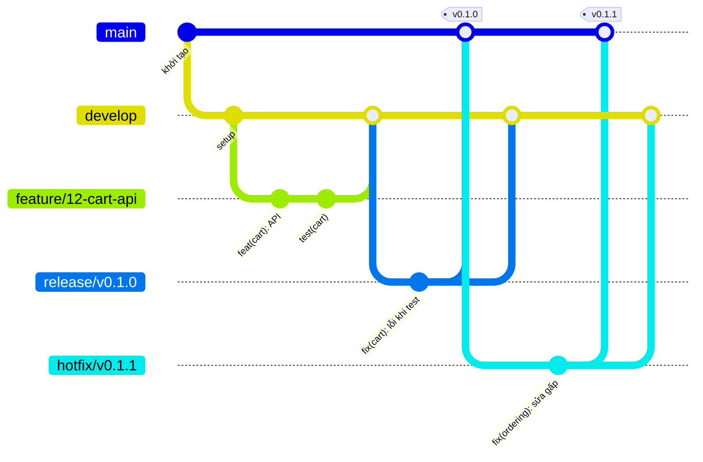

# Git flow

Quy trình làm việc với Git của nhóm. Ai commit vào repo này cũng làm theo tài liệu này.

## 1. Tóm tắt trong một phút

- Code mới luôn làm trên nhánh `feature/*` tách từ `develop`, rồi mở Pull Request (PR) vào `develop`.
- `develop` tự deploy lên môi trường **dev**.
- Cuối sprint, An tách `release/vX.Y.Z` từ `develop`. Nhánh này tự deploy lên **staging** để cả nhóm test.
- Test xong, `release/vX.Y.Z` được merge vào `main`, An gắn tag `vX.Y.Z`, tag đó được deploy lên **prod** sau khi có người duyệt. Sau đó merge release ngược về `develop`.
- Lỗi gấp trên prod thì sửa trên `hotfix/*` tách từ `main`, merge vào cả `main` và `develop`.



## 2. Vai trò của các nhánh

| Nhánh | Tách từ | Merge vào | Deploy tới | Dùng để |
|---|---|---|---|---|
| `main` | — | — | prod, qua tag `vX.Y.Z` | Code đã phát hành, luôn ổn định |
| `develop` | `main` | `release/*` (tách ra) | dev, tự động | Nơi gộp mọi tính năng đã xong |
| `feature/<số-issue>-<tên>` | `develop` | `develop` | stack dev cá nhân | Làm một tính năng |
| `fix/<số-issue>-<tên>` | `develop` hoặc `release/*` | nhánh nó tách ra | stack dev cá nhân | Sửa lỗi chưa lên prod |
| `release/vX.Y.Z` | `develop` | `main`, rồi `develop` | staging, tự động | Gom các tính năng để test trước khi phát hành |
| `hotfix/vX.Y.Z` | `main` | `main`, rồi `develop` | prod sau khi duyệt | Sửa gấp lỗi trên prod |
| `review/<chủ-đề>/r<vòng>` | nhánh cần review | không merge | không | Người review ghi nhận xét thẳng vào code |

Tên nhánh viết thường, nối bằng dấu gạch ngang, có số issue: `feature/12-cart-api`, `fix/31-price-rounding`, `release/v0.1.0`, `hotfix/v0.1.1`, `review/cart-api/r1`. Số trong tên nhánh là **số của issue**, không phải số PR.

## 3. Quy tắc bắt buộc

- **Không push thẳng** vào `main`, `develop`, `release/*`. Mọi thay đổi đi qua PR và CI phải xanh. PR vào `develop` thì người viết tự merge, không cần ai duyệt; PR vào `release/*` và `main` cần 1 người khác duyệt. GitHub đã chặn sẵn.
- **Luôn kéo `develop` mới nhất trước khi tách nhánh**, để bớt conflict.
- **Không force push** lên nhánh dùng chung. Trên nhánh của riêng mình, nếu buộc phải ghi đè sau khi rebase thì dùng `git push --force-with-lease` (xem mục 7).
- **Merge bằng merge commit** ("Create a merge commit" trên GitHub). Lịch sử giữ đủ từng commit và thấy rõ nhánh nào gộp vào đâu.
- **Tiêu đề PR là commit merge**, nên phải theo chuẩn ở mục 5, ví dụ `merge(feature/12-cart-api): tích hợp API giỏ hàng vào develop`.
- **Xoá nhánh sau khi merge.** GitHub tự xoá trên remote; trên máy chạy `git branch -d <tên>`.
- **Chỉ An tạo tag `v*`.** GitHub đã chặn người khác.

## 4. Quy trình theo từng tình huống

### 4.1. Làm một tính năng

1. **Tạo issue trước** (New issue, chọn mẫu). GitHub cấp số, vd. **#12**. Số này dùng để đặt tên nhánh.
2. **Tạo nhánh ngay trong issue** để khỏi gõ nhầm số: cột phải của issue → **Development** → **Create a branch** → sửa tên thành `feature/12-cart-api` → **Create branch**, rồi chạy `git fetch origin` và `git checkout feature/12-cart-api`. Hoặc tạo bằng lệnh như dưới.
3. Code, commit, push:

```bash
git checkout develop
git pull origin develop
git checkout -b feature/12-cart-api

# ... code, test ...
git add .
git commit -m "feat(cart): thêm API thêm sản phẩm vào giỏ"
git push -u origin feature/12-cart-api
```

Mở PR vào `develop` trên GitHub:

- Tiêu đề: `merge(feature/12-cart-api): tích hợp API giỏ hàng vào develop`
- Mô tả theo mẫu, có dòng `Closes #12`, đúng số issue trong tên nhánh. CI chặn nếu tên nhánh không có dạng `feature/<số>-<tên>` hay `fix/<số>-<tên>`, hoặc thiếu `Closes #<cùng số>`
- Số PR luôn khác số issue vì GitHub đếm chung issue và PR, vd. issue #12 có thể thành PR #13 hoặc #20 tuỳ lúc đó người khác đã tạo bao nhiêu issue, PR. Không đổi tên nhánh theo số PR
- Nhánh đã merge là xong việc. Việc tiếp theo thì tạo issue mới, nhánh mới; không mở PR mới từ nhánh cũ
- Chờ CI xanh rồi tự bấm **Create a merge commit**. Không cần chờ ai duyệt; người được GitHub tự mời xem (theo `.github/CODEOWNERS`) đọc và comment nếu thấy vấn đề

### 4.2. Cập nhật nhánh của mình khi develop đã đi tiếp

Cách an toàn nhất là merge `develop` vào nhánh của mình:

```bash
git checkout feature/12-cart-api
git fetch origin
git merge origin/develop
# giải quyết conflict nếu có (mục 6), rồi:
git push
```

Nhánh chỉ mình mình làm và muốn lịch sử thẳng thì có thể rebase:

```bash
git fetch origin
git rebase origin/develop
git push --force-with-lease
```

Không rebase nhánh có người khác cùng commit.

### 4.3. Review và sửa theo review

- PR vào `develop` không bắt buộc duyệt, nhưng người được mời vẫn nên đọc trong ngày. PR vào `release/*` và `main` phải có 1 người khác duyệt.
- Review diễn ra trong PR: comment từng dòng, hoặc **Request changes**. PR đã merge mà còn góp ý thì người viết sửa bằng PR tiếp theo.
- Người viết sửa bằng commit mới trên cùng nhánh, loại `fixreview`, ví dụ `fixreview(cart): đổi tên biến và thêm kiểm tra số lượng âm`. Không amend hay squash commit đã push.
- Khi leader hoặc mentor muốn ghi nhận xét thẳng vào code: tạo nhánh `review/cart-api/r1` từ nhánh cần review, thêm comment vào code, commit loại `review`, ví dụ `review(cart): thiếu kiểm tra null và cấu trúc thư mục chưa đúng`. Người viết đọc nhánh đó rồi sửa trên nhánh feature của mình. Vòng review sau là `r2`, `r3`.

### 4.4. Phát hành (An làm, cuối mỗi sprint)

```bash
# 1. Tách nhánh release từ develop
git checkout develop
git pull origin develop
git checkout -b release/v0.1.0
git push -u origin release/v0.1.0
```

2. Nhánh release tự deploy lên **staging**. Cả nhóm test theo tiêu chí nghiệm thu, chạy E2E.
3. Lỗi tìm thấy khi test: tách `fix/<số-issue>-<tên>` **từ `release/v0.1.0`**, mở PR vào `release/v0.1.0`, cần 1 người khác duyệt. Không thêm tính năng mới vào nhánh release.
4. Test xong: mở PR `release/v0.1.0` → `main`, tiêu đề `release: merge release/v0.1.0 into main`. Hoàng hoặc Nhân duyệt, rồi merge bằng merge commit.
5. Gắn tag trên `main` và đẩy lên:

```bash
git checkout main
git pull origin main
git tag -a v0.1.0 -m "Release version 0.1.0"
git push origin v0.1.0
```

6. Workflow **Deploy prod** chạy, chờ environment `production` được duyệt. **Một người khác An** bấm Approve. Deploy xong, GitHub Release được tạo tự động kèm danh sách thay đổi.
7. Mở PR `release/v0.1.0` → `develop`, tiêu đề `merge(release/v0.1.0): đưa các bản sửa của đợt phát hành về develop`, merge. Sau đó xoá nhánh release.

Mốc phát hành: `v0.1.0` (19/10) · `v0.2.0` (02/11) · `v1.0.0-rc.1` (09/11) · `v1.0.0` (23/11).

### 4.5. Sửa gấp lỗi trên prod (hotfix)

```bash
git checkout main
git pull origin main
git checkout -b hotfix/v0.1.1
# sửa, thêm test
git commit -m "fix(ordering): không tạo đơn khi giỏ hàng rỗng"
git push -u origin hotfix/v0.1.1
```

1. PR `hotfix/v0.1.1` → `main`, tiêu đề `chore: merge hotfix/v0.1.1 into main`. Một người khác duyệt rồi merge.
2. An gắn tag `v0.1.1` trên `main` như bước 5 ở trên.
3. PR `hotfix/v0.1.1` → `develop`, tiêu đề `merge(hotfix/v0.1.1): đưa bản sửa gấp về develop`. Nếu đang có nhánh `release/*` thì merge vào nhánh đó luôn.

## 5. Chuẩn commit message

Cấu trúc: `<type>(<scope>): <mô tả ngắn>`

- `scope` là module (`cart`, `ordering`, `catalog`, `recommendation`, `events`, `admin`) hoặc khu vực (`web`, `api`, `infra`, `data`, `ci`, `deps`). Với commit merge, scope là tên nhánh.
- Mô tả ngắn, viết thường, không chấm cuối câu. Tiếng Việt hay tiếng Anh đều được, nhưng cả PR dùng một thứ tiếng.
- Thêm `!` sau type nếu thay đổi phá vỡ tương thích: `feat(api)!: đổi định dạng lỗi sang problem+json`.
- Mỗi commit được kiểm tra lúc commit (commitlint) và kiểm tra lại trong CI.

| Việc bạn làm | type | Ví dụ |
|---|---|---|
| Thêm tính năng, API, file mới | `feat` | `feat(cart): thêm API cập nhật số lượng` |
| Bắt đầu một tính năng lớn | `feat` | `feat(recommendation): khởi tạo module gợi ý` |
| Sửa hoặc mở rộng logic đã có | `feat` | `feat(catalog): lọc sản phẩm theo khoảng giá` |
| Sửa lỗi | `fix` | `fix(ordering): tính sai tổng tiền khi có 2 món cùng loại` |
| Tăng tốc, giảm độ phức tạp | `perf` | `perf(catalog): bỏ Scan, chuyển sang Query theo category` |
| Sửa cấu trúc code, không đổi hành vi | `refactor` | `refactor(ordering): tách tính giá ra domain/pricing.ts` |
| Ngừng dùng một tính năng hoặc API | `refactor` | `refactor(api): bỏ endpoint /v1/cart/legacy` |
| Xoá code hoặc file không dùng | `chore` | `chore(web): xoá component Banner cũ` |
| Định dạng, khoảng trắng, xoá comment thừa | `style` | `style(api): chạy prettier cho module cart` |
| Tài liệu, README, comment | `docs` | `docs(readme): thêm hướng dẫn chạy DynamoDB Local` |
| Viết hoặc sửa test | `test` | `test(ordering): thêm test đặt hàng trùng Idempotency-Key` |
| Nâng phiên bản thư viện | `chore` | `chore(deps): nâng aws-cdk-lib lên 2.272.0` |
| Build, Docker, cấu hình đóng gói | `build` | `build(docker): thêm MySQL cho bản đối chứng` |
| CI/CD | `ci` | `ci(deploy): chạy Newman sau khi deploy staging` |
| Việc lặt vặt không ảnh hưởng nghiệp vụ | `chore` | `chore(infra): đổi tên biến môi trường` |
| Hoàn tác một commit | `revert` | `revert: revert "feat(cart): thêm API cập nhật số lượng"` |
| Merge một nhánh vào nhánh chung | `merge` | `merge(feature/12-cart-api): tích hợp API giỏ hàng vào develop` |
| Đưa nhánh release lên main | `release` | `release: merge release/v0.1.0 into main` |
| Merge hotfix vào main | `chore` | `chore: merge hotfix/v0.1.1 into main` |
| Ghi nhận xét review vào code | `review` | `review(cart): thiếu kiểm tra số lượng âm` |
| Sửa theo nhận xét review | `fixreview` | `fixreview(cart): thêm kiểm tra số lượng âm theo review` |

## 6. Xử lý conflict

Conflict xảy ra khi hai nhánh sửa cùng một đoạn trong cùng một file. Git dừng lại và đánh dấu đoạn đó:

```text
<<<<<<< HEAD
const MAX_QTY = 5;
=======
const MAX_QTY = 10;
>>>>>>> origin/develop
```

- Từ `<<<<<<<` tới `=======` là thay đổi ở nhánh bạn đang đứng.
- Từ `=======` tới `>>>>>>>` là thay đổi từ nhánh bạn đang gộp vào.

Bạn chọn một trong bốn cách, rồi **xoá hết các dòng đánh dấu**:

| Cách | Kết quả |
|---|---|
| Giữ của mình | `const MAX_QTY = 5;` |
| Giữ của nhánh kia | `const MAX_QTY = 10;` |
| Giữ cả hai (khi cả hai đều cần) | Viết lại sao cho cả hai thay đổi cùng đúng |
| Bỏ cả hai | Xoá cả đoạn, nếu cả hai đều không còn cần |

Sau khi sửa:

```bash
git status            # xem file nào còn conflict
git add <file>
git commit            # nếu đang merge
# hoặc: git rebase --continue   nếu đang rebase
```

Không chắc nên giữ bên nào thì hỏi người viết đoạn code kia. VS Code có sẵn nút *Accept Current*, *Accept Incoming*, *Accept Both* ngay trên đoạn conflict.

## 7. Các lệnh cần hiểu đúng

| Lệnh | Làm gì | Lưu ý |
|---|---|---|
| `git fetch origin` | Lấy commit mới từ remote về, **không** gộp vào nhánh của bạn | Dùng trước khi so sánh: `git diff develop origin/develop` |
| `git pull origin develop` | `fetch` rồi `merge` vào nhánh hiện tại | Đang có code chưa commit thì `git stash` trước |
| `git merge origin/develop` | Gộp nhánh khác vào nhánh hiện tại, tạo commit merge | Cách an toàn để cập nhật nhánh feature |
| `git rebase origin/develop` | Đặt các commit của bạn lên trên đầu `develop` mới nhất | Tạo commit mới (D', E'), nên sau đó phải push ghi đè |
| `git push --force` | Ép remote giống hệt máy bạn | **Không dùng.** Có thể xoá mất commit đồng đội vừa push |
| `git push --force-with-lease` | Ghi đè, nhưng từ chối nếu remote có commit bạn chưa fetch | Chỉ dùng trên nhánh của riêng mình sau khi rebase |
| `git stash` · `git stash pop` | Cất tạm và lấy lại thay đổi chưa commit | Dùng khi cần đổi nhánh gấp |

## 8. Khi gặp "fatal: Not possible to fast-forward, aborting."

Nghĩa là nhánh trên máy bạn và nhánh trên remote **đều có commit riêng**. Git không thể chỉ nhảy thẳng lên bản mới mà không bỏ mất commit của một bên.

Xem mỗi bên có gì:

```bash
git fetch origin
git log --oneline origin/feature/12-cart-api..feature/12-cart-api   # chỉ có ở máy bạn
git log --oneline feature/12-cart-api..origin/feature/12-cart-api   # chỉ có ở remote
```

Rồi chọn một cách:

| Cách | Lệnh | Khi nào |
|---|---|---|
| Merge | `git pull --no-rebase` | Muốn giữ cả hai phía, an toàn nhất |
| Rebase | `git pull --rebase` | Nhánh của riêng bạn, muốn lịch sử thẳng |
| Bỏ phần ở máy, lấy theo remote | `git reset --hard origin/<nhánh>` | Chắc chắn các commit ở máy là bỏ đi được |

## 9. Kiểm tra một nhánh đã được merge chưa

```bash
# Commit có ở feature mà chưa có ở develop. Không in gì nghĩa là đã merge hết.
git log --oneline develop..feature/12-cart-api

# Nhánh nào đang chứa một commit cụ thể
git branch -a --contains <commit-hash>

# So từ điểm chung cuối cùng. Không in gì nghĩa là develop đã có đủ code của nhánh kia.
git diff $(git merge-base develop origin/feature/12-cart-api)..origin/feature/12-cart-api
```

Kiểm tra nhiều nhánh cùng lúc, ví dụ các nhánh review:

```bash
git fetch origin
for br in $(git branch -r --list 'origin/review/*' | sed 's#origin/##'); do
  if git diff --quiet "$(git merge-base develop "origin/$br")..origin/$br"; then
    echo "đã có trong develop: $br"
  else
    echo "CHƯA có trong develop: $br"
  fi
done
```

| Vai trò | Nên dùng |
|---|---|
| Người đang code | `git log develop..feature/x` |
| Người review | `git branch --contains <commit>` |
| Người chuẩn bị release | `git merge-base` + `git diff` trước khi tách nhánh release |

## 10. Đọc commit graph

```bash
git log --oneline --graph --decorate --all
```

```text
*   a1b2c3d merge(feature/12-cart-api): tích hợp API giỏ hàng vào develop
|\
| * 4d5e6f7 test(cart): thêm test giới hạn số lượng
| * 8a9b0c1 feat(cart): thêm API thêm sản phẩm vào giỏ
|/
* 2d3e4f5 chore: khởi tạo cấu trúc repo
```

- **Đọc từ trên xuống** là mới nhất tới cũ nhất: vừa merge nhánh cart, trước đó là 2 commit của nhánh cart, gốc là commit khởi tạo.
- **Đọc từ dưới lên** là quá trình dự án hình thành: khởi tạo → tách nhánh cart → 2 commit → merge vào develop.
- Hai cột song song `| *` là đang có hai nhánh. Dấu `\` và `/` là chỗ tách nhánh và chỗ merge.

Cần xem graph khi: bị lỗi không fast-forward, muốn biết nhánh đã merge chưa, cần hiểu lịch sử dự án, hoặc gặp conflict phức tạp. VS Code có extension *Git Graph* để xem bằng giao diện.

## 11. Làm lại từ đầu theo remote

Chỉ dùng khi nhánh trên máy hỏng và bạn chắc chắn **không cần** thay đổi chưa push:

```bash
git fetch origin
git reset --hard origin/develop   # bỏ mọi commit và thay đổi chưa push trên nhánh này
git clean -fd                     # xoá file mới chưa từng commit
```

Hai lệnh này không hoàn tác được. Chưa chắc thì `git stash` hoặc tạo nhánh sao lưu trước: `git branch backup/truoc-khi-reset`.

## 12. Bảng lệnh nhanh

| Việc | Lệnh |
|---|---|
| Xem mọi nhánh | `git branch -a` |
| Xoá nhánh trên máy | `git branch -d feature/12-cart-api` |
| Xoá nhánh trên remote | `git push origin --delete feature/12-cart-api` |
| Xem thay đổi chưa commit | `git status` · `git diff` |
| Sửa commit message cuối, **chưa push** | `git commit --amend` |
| Bỏ thay đổi một file chưa commit | `git restore <file>` |
| Xem ai sửa dòng nào | `git blame <file>` |
